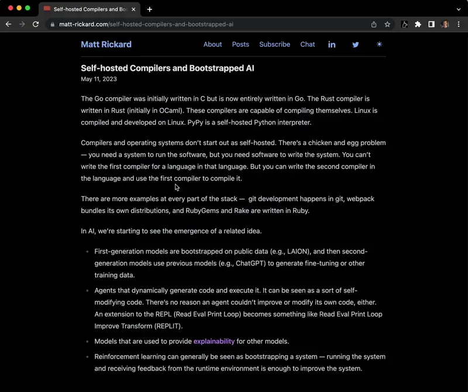

# LLaMaTab Extension

A large language model that runs entirely inside a Chrome Extension. It runs the instruction tuned Vicuna 13B model, based off of LLaMa.



### Installation
To install, head to the [releases](https://github.com/r2d4/react-llm/releases/latest) tab and download the latest `llamatab-extension.zip` file. Then, in Chrome, go to `chrome://extensions`, enable developer mode, and click "Load unpacked". Select the `llamatab-extension` folder from the zip file you downloaded. You should now see the LLaMaTab extension in your toolbar.

## Building from source

```bash
pnpm install
pnpm build:extension
```

The extension zip file will be built to `dist/llamatab-extension.zip`.
